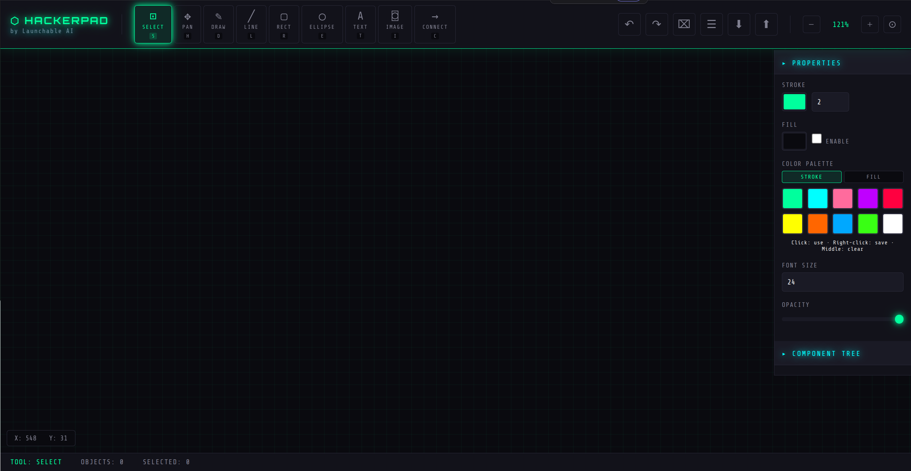

# HACKERPAD

A cyberpunk-themed canvas drawing application built with vanilla JavaScript. No frameworks, no dependencies - just pure HTML, CSS, and JS.



## Features

### Drawing Tools
- **Select (S)** - Select and manipulate objects
- **Pan (H)** - Pan around the canvas
- **Draw (D)** - Freehand drawing
- **Line (L)** - Draw straight lines
- **Rectangle (R)** - Draw rectangles
- **Ellipse (E)** - Draw ellipses
- **Text (T)** - Add text with multiline support
- **Image (I)** - Import images (also supports Ctrl+V paste from clipboard)
- **Connect (C)** - Create connectors between objects

### Object Manipulation
- **Move** - Click and drag any selected object to reposition it (works for all object types)
- **Resize** - Drag corner handles to resize rectangles, images, ellipses, text, and groups
- **Multi-select** - Shift+click to select multiple objects, then move them together
- **Group** - Select 2+ objects and press Ctrl+G to group them. Groups act as a single unit for moving, resizing, and duplicating
- **Ungroup** - Select a group and press Ctrl+Shift+G to dissolve it back into individual objects
- **Enter group** - Double-click a group to "enter" it and select/edit individual children. Click outside or press Escape to exit
- **Lock group** - Lock a group via the radial menu or layers panel to make it a persistent atomic entity. Locked groups cannot be entered or ungrouped
- **Group background color** - Select a group and use the Fill color picker to change its background color

### Interface
- **Right-click radial menu** - Quick tool access with a HUD-style circular menu
- **Properties panel** - Adjust stroke, fill, opacity, and font size
- **Color palette** - Save up to 10 colors for quick access (persisted to localStorage)
- **Component tree** - View and manage all objects on the canvas
- **Zoom controls** - Zoom in/out with mouse wheel or buttons

### Text Editing
- Double-click text to edit in place
- **Enter** - Confirm text and switch to select tool
- **Shift+Enter** - Add new line
- **Escape** - Cancel editing
- Resize text by dragging corner handles

### Projects
- Save/load projects to localStorage
- Export/import projects as JSON files
- Projects persist across browser sessions

### Keyboard Shortcuts
| Key | Action |
|-----|--------|
| S | Select tool |
| H | Pan tool |
| D | Draw tool |
| L | Line tool |
| R | Rectangle tool |
| E | Ellipse tool |
| T | Text tool |
| I | Image tool |
| C | Connect tool |
| Ctrl+C | Copy selected objects |
| Ctrl+V | Paste (system clipboard images or copied objects) |
| Ctrl+D | Duplicate selected objects |
| Ctrl+G | Group selected objects |
| Ctrl+Shift+G | Ungroup selected group |
| Ctrl+Z | Undo |
| Ctrl+Y | Redo |
| Delete/Backspace | Delete selected |
| Escape | Deselect all / exit group |

## Getting Started

Just open `public/index.html` in a browser, or serve it with any static file server:

```bash
# Using Python
python -m http.server 8000 --directory public

# Using Node.js
npx serve public

# Using PHP
php -S localhost:8000 -t public
```

## Tech Stack

- Vanilla JavaScript (ES6+)
- HTML5 Canvas
- CSS3 with custom properties
- localStorage for persistence
- No external dependencies

## License

MIT

---

Built by [Launchable AI](https://launchable.ai)
